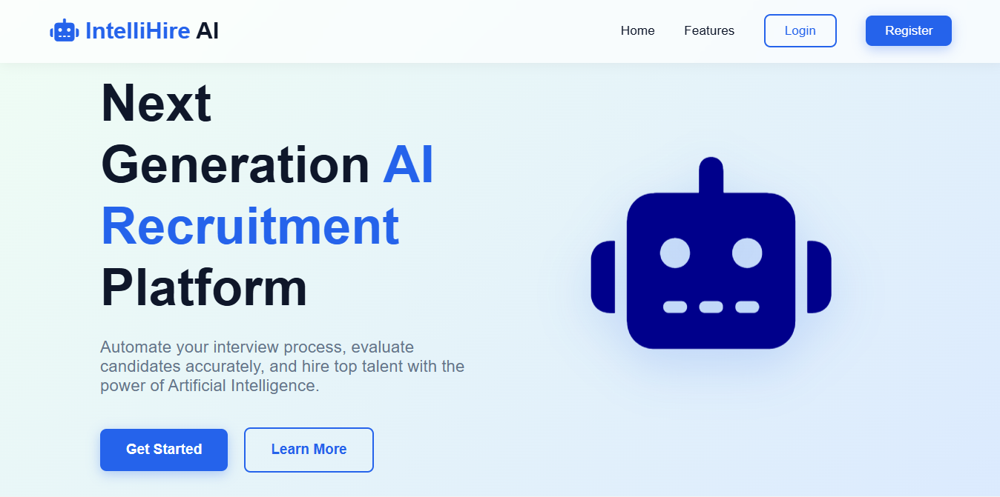
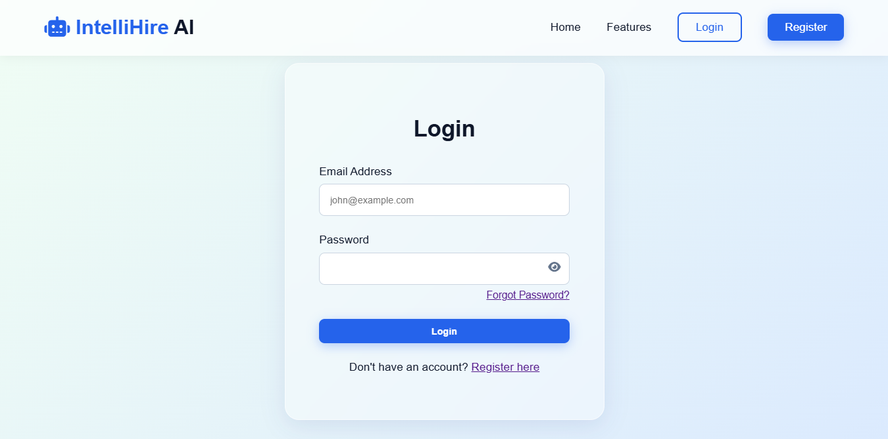
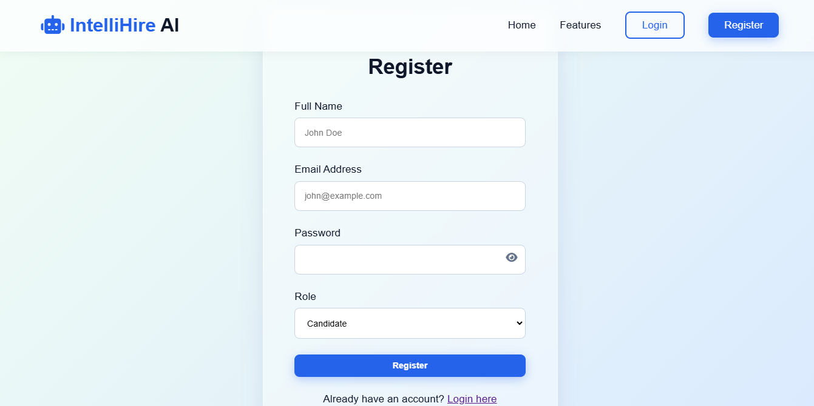
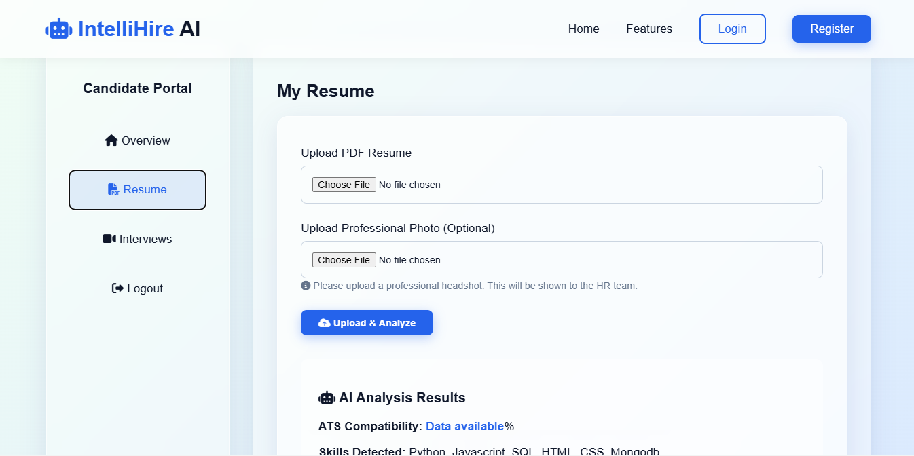
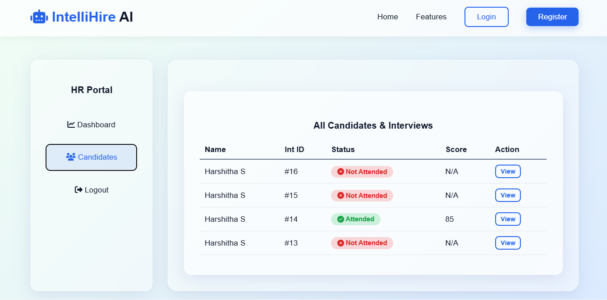
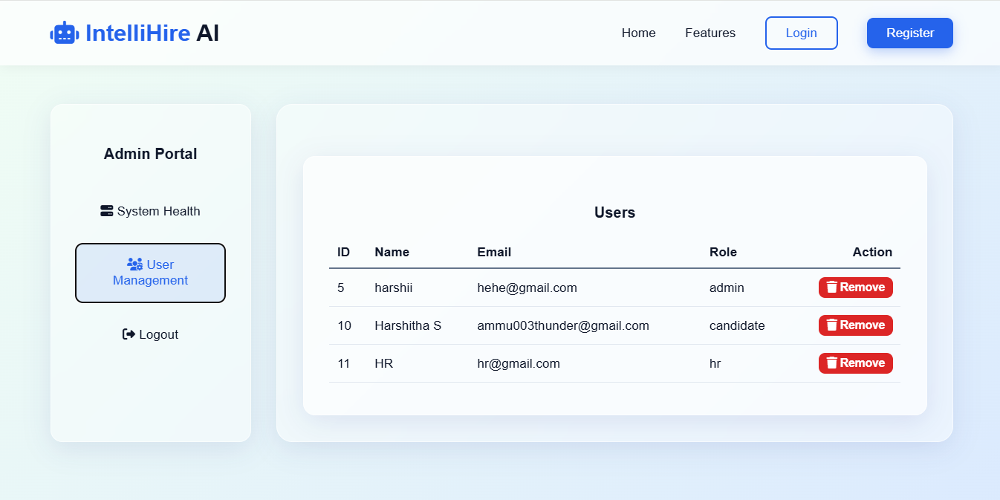

# IntelliHireAI
An AI-powered recruitment and interview assessment platform built with Flask, MySQL, HTML, CSS and JavaScript.

## 🎥 Project Demo

Watch the complete project demonstration here:

📹 https://drive.google.com/file/d/1zQEmSh4F754ccQpACOYT2R0SZfbGtoVq/view?usp=sharing

# 🤖 IntelliHire AI


An AI-powered recruitment and interview assessment platform that automates resume screening, conducts AI-based interviews, and generates detailed performance reports for candidates.

---

# 📌 Overview

**IntelliHire AI** is a web-based recruitment platform built using **Flask**, **MySQL**, **HTML**, **CSS**, and **JavaScript**. The platform helps organizations streamline their hiring process by analyzing resumes, generating AI-powered interview questions, evaluating candidate responses, and providing comprehensive analytics through separate dashboards for Candidates, HR, and Admin.

---

# ✨ Features

## 🔐 Authentication
- Candidate Registration & Login
- HR Login
- Admin Login
- JWT Authentication
- Password Hashing (bcrypt)
- Forgot & Reset Password

---

## 📄 Resume Management
- Upload Resume (PDF)
- Resume Parsing
- OCR Support for Scanned PDFs
- AI Resume Analysis
- ATS Resume Score
- Skills Extraction
- Education & Experience Extraction

---

## 🤖 AI Interview
- AI-generated Interview Questions
- Questions Personalized Based on Resume
- Speech-to-Text Answer Recognition
- AI Voice (Text-to-Speech)
- Webcam Recording
- Interview Timer
- Real-time AI Interaction
- AI Answer Evaluation

---

## 📊 Performance Analysis
- Resume Score
- Interview Score
- Communication Analysis
- Technical Skills Assessment
- Confidence Analysis (Simulated)
- Performance Graphs
- AI Feedback & Recommendations

---

## 👨‍💼 HR Dashboard
- View Candidate Profiles
- Resume Analysis
- Interview Reports
- Candidate Rankings
- Performance Analytics
- Search & Filter Candidates

---

## 👑 Admin Dashboard
- Manage Users
- Manage HR Accounts
- System Analytics
- Database Monitoring
- Reports & Statistics

---

## 📧 Additional Features
- Email Notifications
- PDF Interview Report
- AI Interview Completion Certificate
- Responsive Design
- Glassmorphism UI
- Dark Mode

---

# 🛠️ Technology Stack

### Frontend
- HTML5
- CSS3
- JavaScript

### Backend
- Python
- Flask

### Database
- MySQL

### Authentication
- JWT
- bcrypt

### AI & Document Processing
- Google Gemini API
- pdfplumber
- PyMuPDF (fitz)
- PyTesseract OCR

### Other Libraries
- Flask-Mail
- ReportLab
- Chart.js
- Web Speech API
- MediaRecorder API

---

# 📂 Project Structure

```text
IntelliHireAI/
│
├── app.py
├── config.py
├── database.sql
├── requirements.txt
├── .env.example
│
├── models/
├── routes/
├── services/
├── static/
├── templates/
├── uploads/
├── utils/
└── README.md
```

---

# 🚀 Installation

## 1. Clone the Repository

```bash
git clone https://github.com/Harshitha032/IntelliHireAI.git
cd IntelliHireAI
```

---

## 2. Create a Virtual Environment

```bash
python -m venv venv
```

### Windows

```bash
venv\Scripts\activate
```

### macOS/Linux

```bash
source venv/bin/activate
```

---

## 3. Install Dependencies

```bash
pip install -r requirements.txt
```

---

## 4. Configure MySQL

Create a database named:

```sql
CREATE DATABASE intellihire;
```

Import the database schema:

```bash
mysql -u root -p intellihire < database.sql
```

---

## 5. Create a `.env` File

```env
SECRET_KEY=your_secret_key
DB_HOST=localhost
DB_USER=root
DB_PASSWORD=your_password
DB_NAME=intellihire
GEMINI_API_KEY=your_api_key
```

---

## 6. Run the Application

```bash
python app.py
```

Open your browser:

```
http://127.0.0.1:5000
```

---

# 👥 User Roles

### 👤 Candidate
- Register/Login
- Upload Resume
- AI Resume Analysis
- Attend AI Interview
- View Interview Results
- Download Report & Certificate

### 👨‍💼 HR
- View Candidate Profiles
- Review Resume Scores
- Analyze Interview Reports
- Access Performance Analytics

### 👑 Admin
- Manage Users
- Manage HR Accounts
- Monitor Platform
- View System Statistics

---

# 📸 Project Screenshots

## 🏠 Homepage

<p align="center">
  
</p>

## 🔐 Login Page

<p align="center">
  
</p>

## 📝 Register Page

<p align="center">
  
</p>

## 👤 Candidate Portal

<p align="center">
  
</p>

## 👨‍💼 HR Portal

<p align="center">
  
</p>

## 👑 Admin Portal

<p align="center">
  
</p>

---

# 📄 License

This project is developed for educational and internship purposes.

---

# 👩‍💻 Developed By

**Harshitha S**

Computer Science Engineering Student

### IntelliHire AI – AI-Powered Recruitment & Interview Assessment Platform
